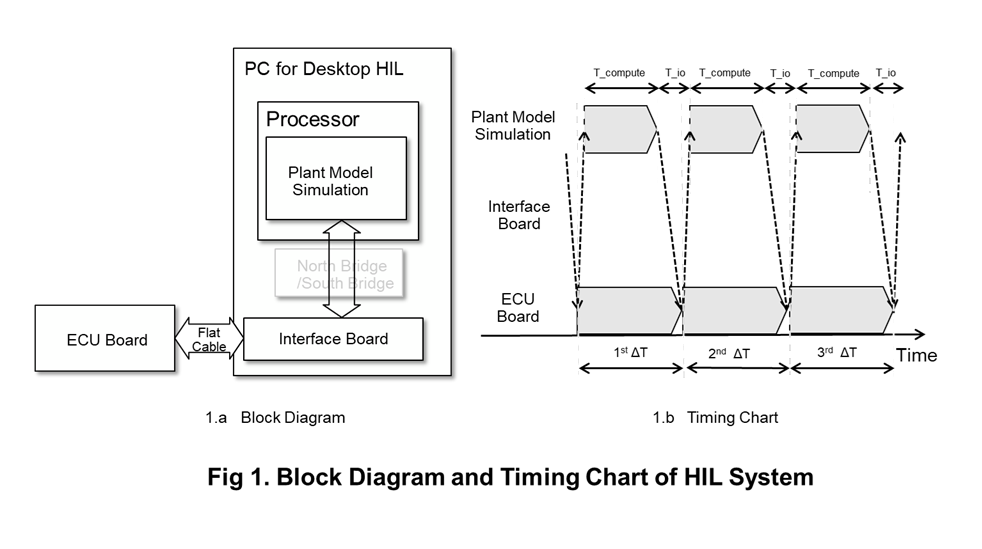
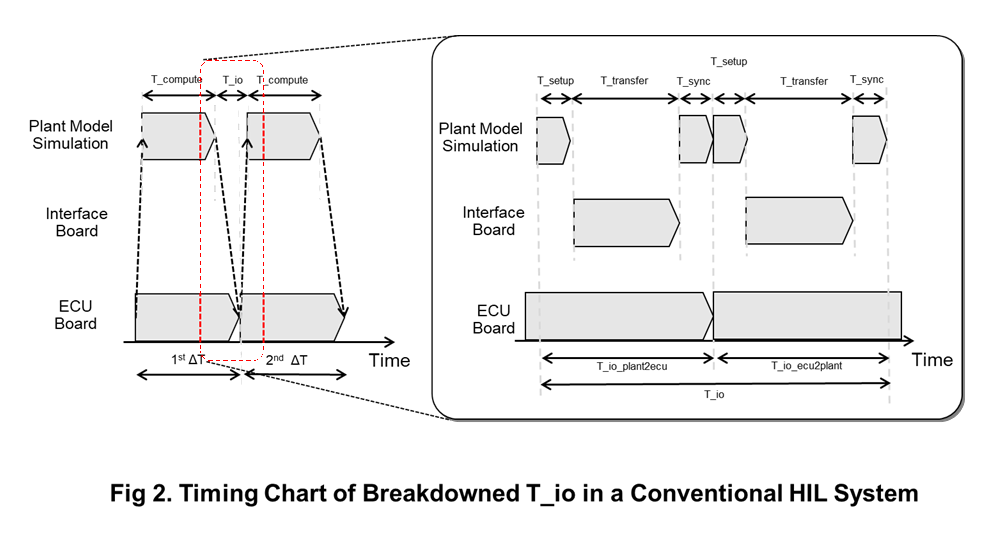
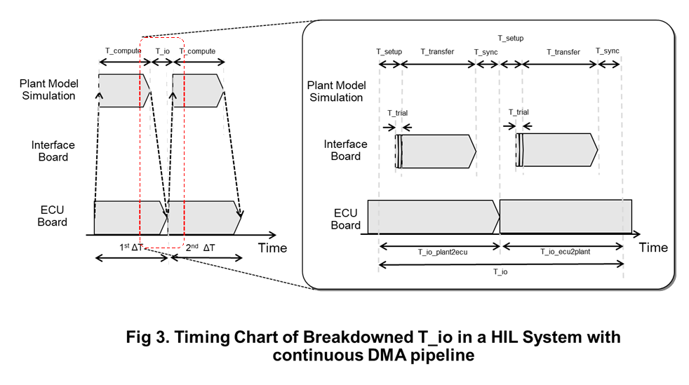
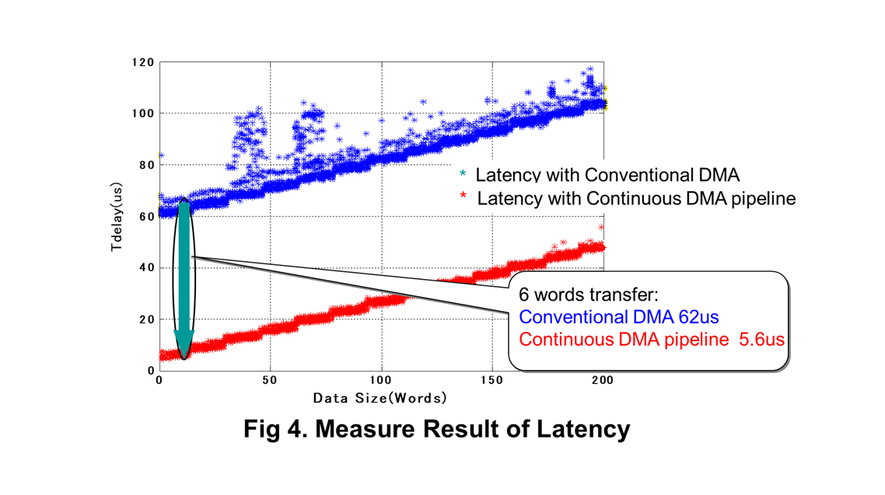

# Continuous DMA Pipeline for Low-Latency HILS I/O Design

[Japanese Version](./continous_dma_jp.md)

## Design Challenge

Hardware-in-the-Loop Simulation (HILS) is an essential environment for validating control algorithms by connecting a real ECU with a plant model. In HILS, the ECU and plant model run in parallel, and data must be exchanged via an interface board at a fixed period ΔT (Fig. 1).

The period ΔT is determined by the time constants of the plant model. In high-speed power systems such as motor current control and inverter control, very short cycle times on the order of several microseconds to several tens of microseconds are required. Therefore, for HILS to operate in real time, both I/O processing and plant computation must complete within a single cycle. This condition is expressed as:

`ΔT > T_io + T_compute`

In practice, however, the I/O latency T_io often accounts for 10%–30% of ΔT [1], and in some cases even more [2], making it a major constraint for achieving shorter cycle times. In particular, when the CPU is involved in DMA setup and transfer completion detection, software overhead becomes a dominant factor.

In a typical system, the I/O latency can be decomposed as:

`T_io ≃ 2 × (T_setup + T_transfer + T_sync)`

Here, T_setup represents DMA configuration and initiation, and T_sync represents transfer completion detection. Both depend on CPU-based PIO access or interrupt handling. This CPU involvement is a primary source of latency and jitter.

One possible solution is to implement both I/O processing and the plant model entirely on FPGA. However, this approach lacks flexibility for model changes and incurs high development cost. Therefore, a method is required to reduce only the I/O latency while maintaining a general-purpose CPU-based environment.

## Approach

In the conventional approach (Fig. 2), the CPU intervenes in every DMA transaction, introducing T_setup and T_sync.

In contrast, the proposed design (Fig. 3) completely removes CPU involvement from DMA transfers and adopts a configuration in which an FPGA on the interface board autonomously executes DMA.

The DMA descriptor is configured only once during initialization and is not updated during HILS execution. In subsequent cycles, the FPGA operates as a bus master and autonomously initiates DMA transfers.

The decision to proceed with a transfer is based on a timestamp placed at the head of the transfer buffer. The DMA engine reads memory sequentially and retrieves the timestamp in the first burst. If the timestamp has not been updated, the transfer is aborted without issuing subsequent bursts, and the DMA is retried. If the timestamp has been updated, the remaining data is transferred.

With this mechanism, CPU-driven DMA initiation and completion detection are eliminated, and the I/O latency can be approximated as:

`T_io ≃ 2 × (T_trial + T_transfer)`

Here, T_trial represents the time required for a DMA attempt to check the timestamp.

The timestamp is a 64-bit monotonically increasing counter, incremented once per cycle ΔT. In this design, the timestamp serves as a commit point for data updates.

On the CPU side, all data is updated first, followed by the timestamp update. To ensure that write ordering is preserved, a write memory barrier (store-store barrier) is used. The DMA buffer must be either cache-coherent or non-cacheable; in non-coherent systems, cache flushing is required.

Because the timestamp is updated only after all data updates are completed, the DMA observes only committed data. If the timestamp has not been updated, the transfer is aborted, which suppresses the possibility of reading partially updated data in subsequent bursts.

Although a DMA retry is a short operation involving only a minimal burst transfer, it still requires bus arbitration and occupies the bus for a finite duration. Therefore, an increased number of retries reduces overall bus efficiency.

To address this, the proposed design introduces a mechanism to dynamically adjust the DMA start timing. Specifically, the DMA start timing for the next cycle is corrected based on the difference between the current start time and the successful transfer time in the previous cycle. This allows the DMA to be triggered immediately after the timestamp update, minimizing retries.

At system startup, DMA begins earlier by approximately T_setup + T_sync, resulting in retries. As the timing correction converges, T_trial approaches zero, and in steady state, transfers are performed with almost no retries.

## Constraints and Trade-offs

This design eliminates software overhead associated with DMA setup and completion detection. Therefore, it is particularly effective for small data transfers where such overhead is dominant. As the transfer size increases, however, the data transfer time T_transfer becomes dominant, and the relative improvement decreases.

Additionally, since DMA retries occupy the bus, contention with other bus masters may degrade performance. In such environments, optimizing the DMA start timing is critical.

Furthermore, ensuring data consistency requires that system assumptions regarding memory visibility and write ordering (e.g., cache coherency and memory barriers) are satisfied.

## Notes

This design was implemented to reduce I/O latency in a HILS system and evaluated on a 33 MHz / 32-bit PCI bus with a real-time Linux environment (PREEMPT_RT). For a transfer size of 6 words (12 words round-trip), the I/O latency was reduced from approximately 62 μs to 5.6 μs, achieving about a 90% reduction (62 μs → 5.6 μs) (Fig. 4). Jitter was also reduced to within 1 μs.

This approach is applicable not only to HILS but also to any real-time system involving periodic data transfers. The design concept and implementation have been patented ([WO20110060852](https://patents.justia.com/patent/20110060852)).

## References
- [1] [Hardware-in-the-loop: key challenges and considerations](https://www.automotivetestingtechnologyinternational.com/industry-opinion/hardware-in-the-loop-key-challenges-and-considerations.html)
- [2] [National Instruments Application Notes: Key Considerations for Powertrain HIL Test](https://www.ni.com/pdf/app-note/HIL-AppNotes-IA.pdf)

***
- [<-Go back to index](../README.md)
- [<-Go back to Japanese index](../README_JP.md)