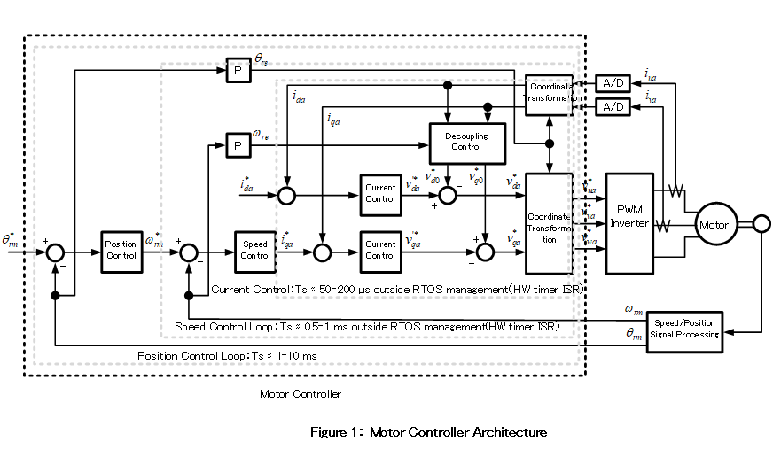
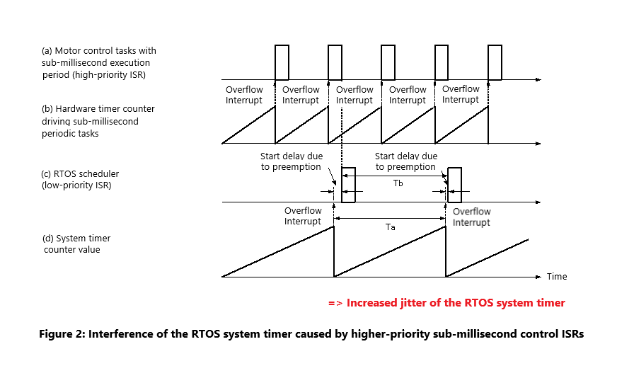
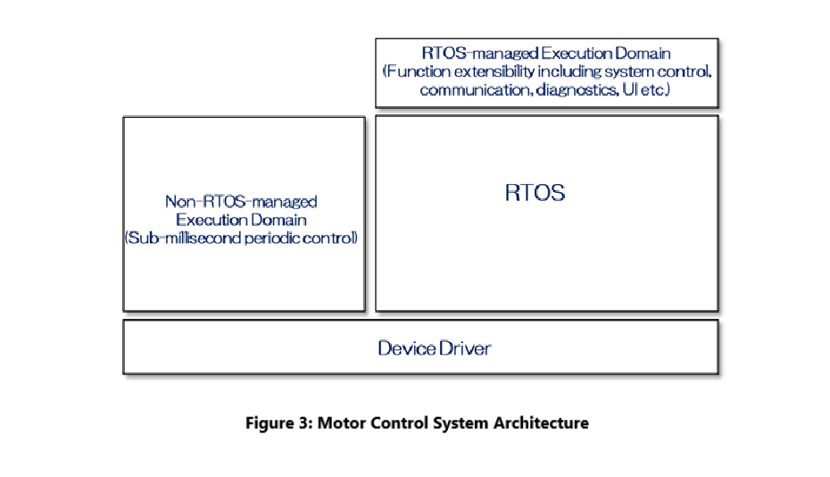
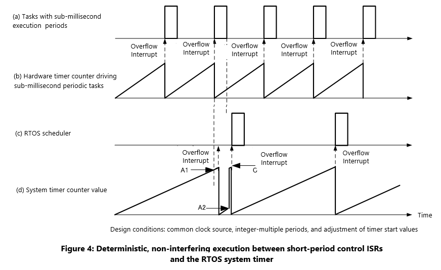

# RTOS-based Motor Control System 
[Japanese Version](./motor_control_system_jp.md)

## Design Challenges

RTOS-based control systems facilitate parallel development at the functional level and enable future extensibility. At the same time, minimizing the execution overhead introduced by the RTOS itself becomes a critical design challenge. One of the major sources of RTOS overhead is the system timer ISR, which underpins task scheduling and time management functions such as task delays, timeout monitoring, and software timers.

In general, an RTOS system timer incurs an overhead of several microseconds per trigger. While shortening the timer period improves time management accuracy, it also increases the execution load of the RTOS. As a result, practical systems typically configure the system timer period in the range of approximately 1 ms to several tens of milliseconds.

When building a motor control system on top of an RTOS, the implementation must include not only the motor controller itself, but also higher-level applications that generate control commands, as well as communication interfaces with the external environment. These higher-level functions usually operate at periods longer than the RTOS system timer and can therefore be implemented as RTOS-managed periodic tasks. In contrast, implementing the motor controller itself on an RTOS requires more careful architectural consideration.

Motor controllers typically employ a triple-loop control structure consisting of current, velocity, and position control loops(Fig. 1). Among these, the current and velocity control loops are constrained by the physical characteristics of the motor, such as armature inductance and inertia, and often require control periods shorter than 1 ms. Consequently, these control loops must be activated at rates faster than the typical RTOS system timer period (on the order of several milliseconds).

Under fixed-priority preemptive scheduling—particularly when using Rate Monotonic Scheduling—shorter-period tasks are assigned higher priorities. A common design approach is therefore to allocate dedicated hardware timer interrupts to the current control loop, velocity control loop, and the RTOS system timer, assigning higher priorities to the shorter-period interrupts.

However, in this configuration, the current and velocity control loops often have higher priorities than the RTOS system timer. Depending on execution timing, this can block the execution of the RTOS system timer ISR, disrupting global time management and introducing jitter and degraded timing accuracy(Fig. 2). Such disruption not only increases execution jitter in RTOS-managed periodic tasks, but can also delay watchdog timer servicing, potentially leading to unintended system resets in the worst case. This represents a highly hazardous condition for a control system.

Conversely, imposing constraints such as restricting watchdog servicing to a specific RTOS-managed task significantly reduces design flexibility. Thus, fixed-priority preemptive RTOS-based control systems inherently suffer from interference between periodic tasks and between periodic tasks and the RTOS system timer, complicating timing analysis and increasing both execution jitter and RTOS-induced overhead. Eliminating these interference relationships at a structural level has therefore been strongly desired.

## Solution Approach

To address these issues, the proposed design adopts an architecture that clearly separates processing groups with different control periods, intentionally structuring RTOS-managed and non-RTOS-managed execution domains(Fig.3).

First, higher-level functions such as system control, communication, diagnostics, logging, and UI are implemented as RTOS-managed periodic tasks. All task periods are designed to have integer-multiple relationships, and only a single RTOS periodic task is activated, with a period equal to the greatest common divisor of those task periods. Each higher-level function is then statically scheduled within this RTOS task according to its assigned period.

This approach not only simplifies implementation and timing analysis, but also significantly reduces interference among periodic tasks and between those tasks and the RTOS system timer within the RTOS-managed domain.

Next, control loops that require periods shorter than the RTOS system timer—namely the current and velocity control loops—are implemented as short-period hardware timer interrupts outside of RTOS management. These short-period control loops are designed such that their periods have integer-multiple relationships with the RTOS system timer period, and both are driven from the same clock source. Furthermore, the initial offset of the RTOS system timer is adjusted so that the RTOS system timer interrupt always occurs after completion of the short-period hardware timer interrupt, and both timers are started simultaneously.

With this configuration, the periodic phase relationship between the RTOS system timer and the short-period hardware timer interrupts can be deterministically fixed. This enables safe coexistence of high-frequency control loops and RTOS-managed tasks without blocking the RTOS scheduler(Fig. 4).

## Constraints and Trade-offs

This design assumes static scheduling of RTOS-managed periodic tasks. As a result, it is not well suited for workloads with dynamically changing task periods or execution-time-dependent scheduling requirements. In addition, some standard RTOS timer services and dynamic scheduling mechanisms may be restricted.

On the other hand, for real-time control systems in which the periodic structure can be determined at design time, prioritizing execution determinism and temporal consistency significantly improves analyzability, safety, and overall system reliability.

## Additional Notes

This design was implemented as part of a motor control software platform that I developed during my tenure at Nidec. It substantially reduced execution jitter in RTOS-managed tasks and effectively eliminated unnecessary system resets caused by watchdog timer timing violations.

Although the discussion assumes a triple-loop control structure, not all motor control applications require this configuration. For example, pumps and fans that do not require robustness against load variations may omit the current control loop, while high-speed, high-precision position control applications may omit the velocity control loop. In some cases, such as toys, even open-loop motor control may be employed. In all of these applications, the proposed framework remains applicable without modification, requiring only the removal of unnecessary functional components.

An alternative approach is to tolerate interference between periodic tasks and the RTOS system timer and rely on Worst-Case Response Time Analysis to ensure that control task jitter remains within acceptable limits, potentially involving task consolidation. However, this approach tends to incur high redesign costs and makes failure analysis more difficult when issues arise.

The proposed method is applicable not only to motor control systems but also to a wide range of real-time control systems requiring sub-millisecond control loops. The underlying design concept and implementation approach have been patented [WO2017203776](https://patentscope2.wipo.int/search/en/detail.jsf?docId=WO2017203776).

***
- [<-Go back to index](../README.md)
- [<-Go back to Japanese index](../README_JP.md)
