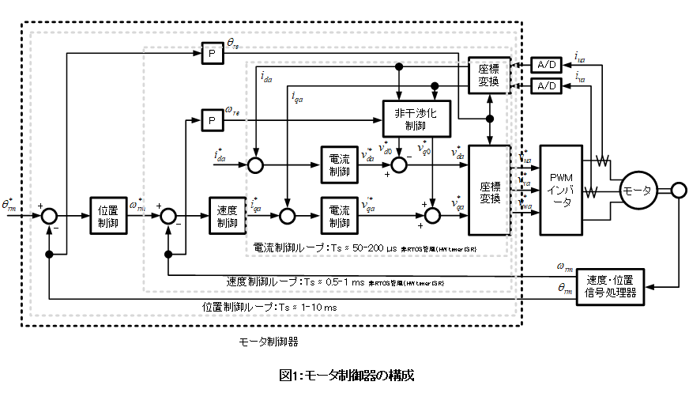
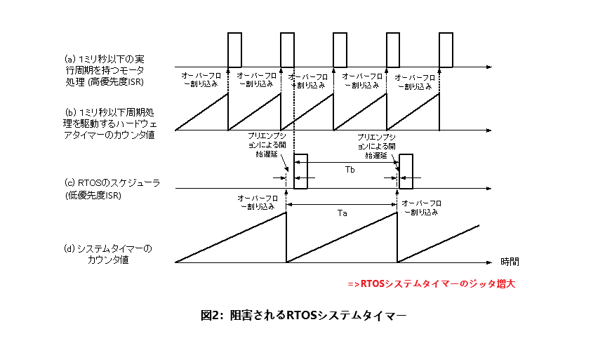
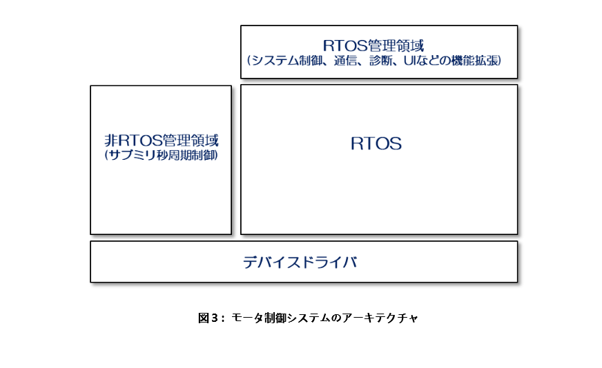
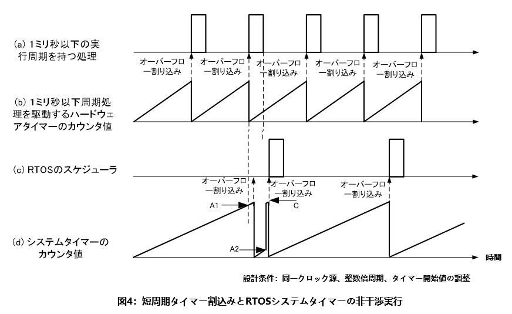

# RTOSを使ったモータ制御システム 
[English Version](./motor_control_system_en.md)

## 設計課題

　RTOSを用いた制御システムは、機能単位での並行開発や将来的な機能拡張を容易にする一方で、RTOS導入に伴う実行オーバーヘッドをいかに抑制するかが重要な設計課題となる。RTOSにおける主要なオーバーヘッド要因の一つがシステムタイマISRであり、タスクスケジューリングや時間管理（タスクの休止、タイムアウト監視、ソフトウェアタイマーなど）は、このシステムタイマーに基づいて実現される。

　一般にRTOSのシステムタイマーは、1回のトリガーあたり数マイクロ秒程度のオーバーヘッドを持つ。周期を短く設定すれば高精度な時間管理が可能となる一方で、RTOS自身の実行負荷は増大する。そのため、実システムにおいてはシステムタイマー周期を概ね1ms〜数10ms程度に設定することが多い。

　RTOS上でモータ制御システムを構成する場合、モータ制御器本体に加え、制御指令を生成する上位アプリケーションや外界との通信機能を実装する必要がある。これらの上位機能は、システムタイマーよりも長い周期での実行で十分であり、RTOS管理下の周期タスクとして実装可能である。一方で、モータ制御器そのものをRTOS上で実装する際には、より慎重な設計上の配慮が求められる。

　モータ制御器は通常、電流制御ループ、速度制御ループ、位置制御ループからなる三重制御ループ構造を持つ(図1)。このうち、電流制御ループおよび速度制御ループの制御周期は、モータの電機子インダクタンスや慣性モーメントといった物理特性によって決定されるため、1ms未満の周期が要求されることが多い。その結果、これらの制御ループは典型的なRTOSシステムタイマ周期（数 ms）よりも短い周期で起動させる必要がある。

　固定優先度・プリエンプティブスケジューリング、特にレートモノトニックスケジューリング（Rate Monotonic Scheduling）に基づいて設計を行う場合、周期の短い処理ほど高い優先度が割り当てられる。このため、電流制御ループ、速度制御ループ、RTOSシステムタイマーのそれぞれに個別のハードウェアタイマー割り込みを割り当て、短周期割り込みに高い優先度を与える構成が良くある構成である。

　しかしこの構成では、電流制御ループや速度制御ループがRTOSシステムタイマーよりも高い優先度を持つため、実行タイミングによってはRTOSシステムタイマーの処理が阻害され、システム全体の時間管理が乱れる（ジッタが発生し、時間精度が劣化する）可能性がある(図2)。時間管理が乱れると、RTOS管理下の周期タスクにおける実行ジッターが増大するだけでなく、ウォッチドッグタイマーのクリアが遅延し、最悪の場合、不要なシステムリセットを引き起こすおそれがある。これは制御システムとして極めて危険な状態である。

　一方で、ウォッチドッグタイマーのクリアを特定のRTOS管理タスクに限定するなどの制約を設けると、システム設計の自由度を著しく損なうことになる。このように、RTOSを用いた固定優先度・プリエンプティブ制御システムでは、周期タスク間、あるいは周期タスクとRTOSシステムタイマー間の阻害関係がタイミング解析を複雑化し、周期実行ジッターおよびRTOS導入に伴う実行オーバーヘッドを増大させるという問題を内包している。これらの阻害関係を構造的に解消することが強く求められていた。

## 解決アプローチ

　本設計では、制御周期の異なる処理群を明確に分離し、RTOS管理領域と非RTOS管理領域を意図的に構造化するアーキテクチャを採用した(図3)。

　まず、上位のシステム制御、通信、診断、ログ、UIといった機能は、RTOS管理下の周期タスクとして実装する。これらのタスク周期はすべて整数倍関係となるように設計し、それら周期の最大公約数に相当する周期を持つ単一のRTOS周期タスクのみを起動する。各上位機能は、このRTOS周期タスク内にスタティックスケジューリングにより周期ごとに配置される。

　この方式により、実装およびタイミング解析が容易になるだけでなく、RTOS管理下においては周期タスク間およびRTOSシステムタイマーとの阻害関係が大幅に単純化される。

　次に、RTOSシステムタイマーよりも短い周期を必要とする電流制御ループおよび速度制御ループについては、RTOS管理外の短周期ハードウェアタイマー割り込みとして実装する。この際、短周期制御ループの周期とRTOSシステムタイマー周期が整数倍関係となるように設計し、両者を同一のクロック源で駆動する構成とした。さらに、短周期ハードウェアタイマー割り込みの処理完了後にRTOSシステムタイマー割り込みが発生するよう、システムタイマーの開始値を調整した上で、両タイマーを同時に起動する。

　この構成により、RTOSシステムタイマーと短周期ハードウェアタイマー割り込み間の周期的な位相関係を決め打ちでき、RTOSスケジューラを阻害することなく、高頻度制御ループとRTOS管理タスクを安全に共存させることが可能となった(図4)。

## 制約およびトレードオフ

　本設計は、RTOS管理下の周期タスクを静的にスケジューリングすることを前提としているため、タスク周期の動的変更や、実行時に周期が変化するワークロードには適さない。また、RTOS標準のタイマーサービスや動的スケジューリング機構の一部は利用制限を受ける。

　一方で、周期構造が設計時に確定可能なリアルタイム制御システムにおいては、実行タイミングの決定性と時間整合性を最優先することで、解析容易性、安全性、システム信頼性を大きく向上させることができる。

## 追記

　本設計は、私がNidec在籍時に設計したモータ制御ソフトウェアプラットフォームの一部であり、RTOS管理下タスクの周期ジッターを大幅に低減するとともに、ウォッチドッグタイマーに起因する不要なシステムリセット事象を実質的に解消した。

　本設計では三重制御ループ構造を前提として説明したが、すべてのモータ制御アプリケーションにおいて必ずしもこの構造が必要となるわけではない。例えば、負荷変動への耐性が求められないポンプや送風機などの用途では電流制御ループを省略する場合があり、高速応答を重視する高精度位置制御用途では速度制御ループを省略することもある。さらに、玩具などの用途ではオープンループ制御が採用されることもある。これらのアプリケーションにおいても、本設計で提示したフレームワークを変更する必要はなく、必要な機能のみを削除することで柔軟に対応可能である。

　また、周期タスクとRTOSシステムタイマー間の阻害関係を許容したまま最悪応答時間解析（Worst-Case Response Time Analysis）を行い、制御周期タスクのジッターが要求仕様を満たすようにタスク統廃合を含めて設計するアプローチも存在する。しかしこの手法は、設計の手戻りコストが大きく、問題発生時の解析が困難になりやすい。

　本手法はモータ制御に限らず、サブミリ秒周期の制御ループを要する各種リアルタイム制御システムにも適用可能である。本設計思想および実装方式は、関連特許[WO2017203776](https://patentscope2.wipo.int/search/en/detail.jsf?docId=WO2017203776)として権利化されている。

***

- [<-日本語版メモの索引](../README_JP.md)
- [<-英語版メモの索引](../README.md)